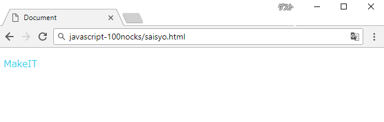
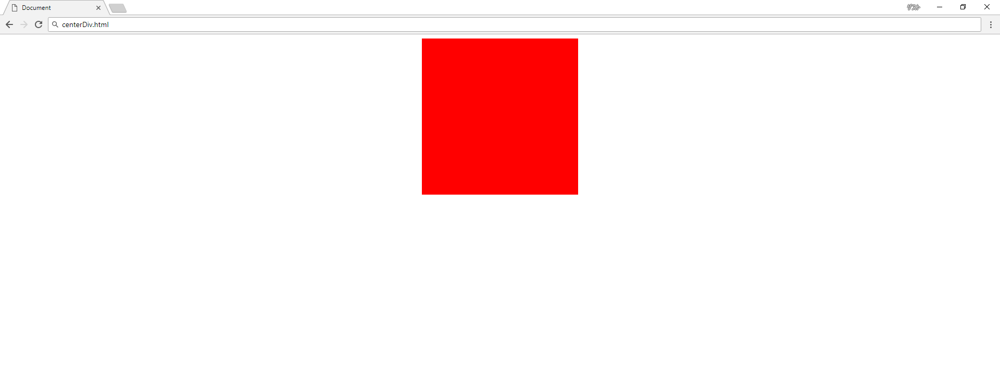
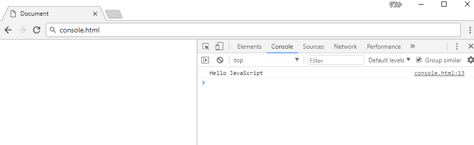
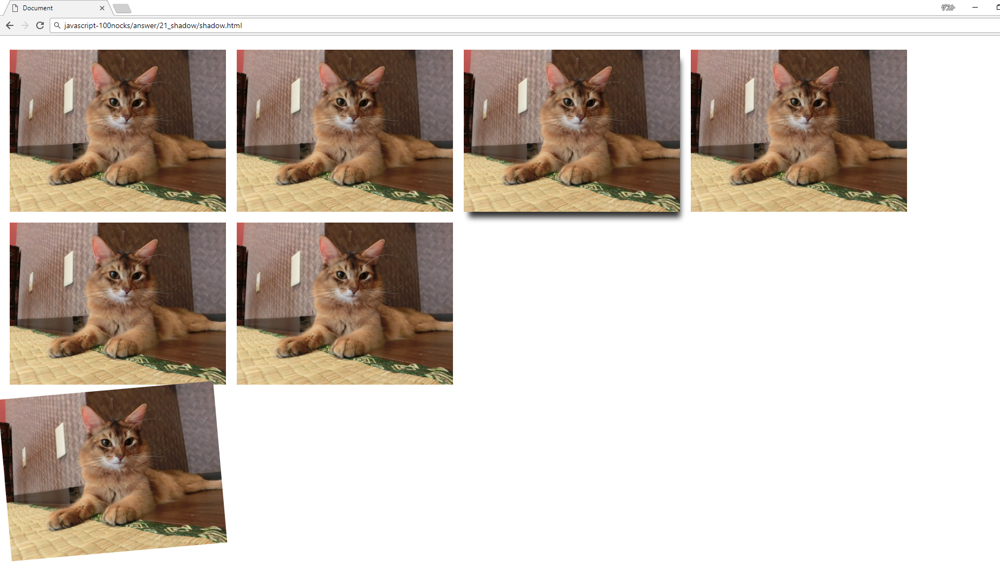
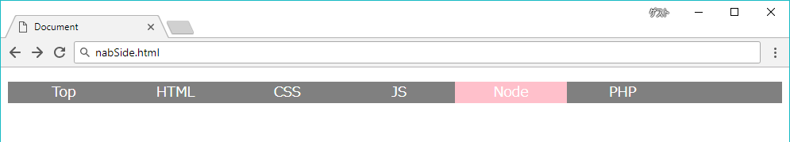
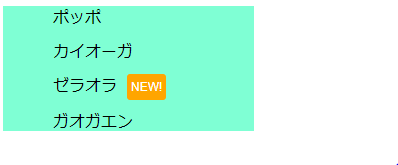

# JavaScript-100nocks （随時更新）
- MakeIT 研修用プログラム

## - 目標
HTML、CSS、JavaScriptの基礎が理解でき、扱えること

一例としての回答を[answer](./answer)に設置します。自分と相談してから確認して下さい。

---

## - Warm up
---

#### 1 saisyo
HTMLファイルを作成し、MakeITと表示してください。文字はCSSを使って色を#20D0F0にしてください  



---
#### 2 centerDiv
300px四方のdivを画面の上部中央に表示してください。色は赤、画面幅が変わっても中心に移動するようにして下さい



---
#### 3 helloTable 
3x3の表を画面に表示して下さい。コンテンツはすべて「こんにちは」。一番左の列は縦に３つ結合してください


---
#### 4 console
console.logを使ってコンソールに「Hello JavaScript」と出力して下さい



---
#### 5 bored
画面中央に表示された「I'm so bored」の文字をクリックすると「AWESOME!」に書き換わるプログラムを作成してください。「AWESOME」は大きさ128px、色黒以外

---
#### 6 isSame
ボタンを押すと2つのテキストフォームに入力された文字列を比較し、同一文字列であれば「True」、それ以外であれば「False」とアラート出力するプログラムを作成してください


---
#### 7 sumSequence
1からnまでの和をコンソール出力するプログラムを作成してください。nはフォームに入力された値である。for文を使用すること


---
#### 9 anchor
[Yahoo Japan](https://www.yahoo.co.jp/)に遷移するリンクを3つ表示してください  
1つは同一のタブ上で開くように  
1つは新しいタブで開くように  
1つはjavascriptのwindow.open()を使用して開くように

---


## - Baby
---


#### 10 countUp
ボタンを押すと画面に表示された数字が1つずつカウントアップされるプログラムを作成してください。カウントが3の倍数の時に表示が変わるようにしてください


---
#### 11 array1
配列内を順にコンソール出力してください  
入力:  `const ary = ['a','b','c','d','e','f','g'];`  
出力: 
```javascript
a
b
c
d
e
f
g
```


---
#### 12 array2
配列内を順にコンソール出力してください。出力の際に各要素のindex値を足して下さい  
入力:  `const ary = ['a','b','c','d','e','f','g'];`  
出力: 
```
a0
b1
c2
d3
e4
f5
g6
```

---
#### 13 array3
宣言された変数が配列かどうか評価してください
入力
```javascript
var ary=[]
var num=1
var obj={}
```
出力
```javascript
true
false
false
```


----
#### 14 typeof
以下の様に宣言された変数の型を評価して出力してください。  
入力: 
```javascript
var num=1; 
var zero=0;
var str='1';
var zs='0';
```
出力
```javascript
number
number
string
string
```


---
#### 15 concat
2つの配列を結合して出力してください  
配列1 `ary1=['a','b']`  
配列2 `ary2=['c','d']`  
出力
```javascript
['a','b','c','d']
```


---
#### 16 join
15 concat で作った配列を出力してください。出力する際、配列内の要素を結合して出力してください  
配列 `ary=['a','b','c','d']`  
出力  
```javascript
abcd
```


---
#### 17 rensouhairetu
連想配列に値を1つ追加し、配列内のすべてのkeyとvalueを出力してください
連想配列: `ary={'color':'red','size':'100'}`
追加する要素: `{'count':'5'}`
```
keyは: color valueは: red
keyは: size valueは: 100
keyは: count valueは: 5
```

---

## - Easy

---

#### 18 add
自身が呼び出された数を出力する関数addを作成してください。
e.g.
```javascript
add();
add();
add();
```
出力
```
1
2
3
```


---
#### 19 wather
配列aryの内容をランダムに出力するプログラムを作成してください。  
配列ary `ary=['晴れ','雨','曇り','槍',]`  
e.g.出力
```
今日の天気は 槍 です
今日の天気は 晴れ です
今日の天気は 晴れ です
今日の天気は 曇り です
今日の天気は 雨 です
```


---
#### 20 tanuki
入力された文字列に含まれる「た」が連続した場合一文字に置換して、一つ以上の「ふ」が含まれた場合は「ふ」をすべて削除して出力するプログラムを作成してください。  
入力値
```text
ふわたたしが両手をひろげても、
お空はちっとも飛べないが、
飛べる小鳥はわたたしのように、
地面をはやくは走れない。

わたたしがからだをゆすっても、
ふきれいな音は出ないけど、
あの鳴る鈴はわたたしのように、
たたくさんなうたたは知らないよ。

鈴と、小鳥と、それからわたたし、
みんなふちがって、みんないい。
```


---
#### 21 shadow
画面にheight:auto、width:400pxの画像を横方向に6枚出力してください。3枚目の画像には、縁に影をつけて強調してください。画像は画面端で自動的に折り返すようにしてください。  
最後にもう一枚画像を出力してください。最後の一枚一つ下の領域に斜めにして表示してください



---
#### 22 pulldown
0から200まで選択できるプルダウンメニューを作ってください。javascript:document.createElement()を使うこと


---
#### 23 form
formタグを使って個人情報送信フォームを作ってください。完成後submitボタンを押して、URLを確認して下さい。入力された情報がURLに正しく追記されているか確認して下さい。  
フォームの仕様
```
名前: (type="text") 必須項目
Eメール: (type="email") 
パスワード: (type="password")
年齢: (selectタグとoptionタグ) 0~200歳まで選べること
性別: (type="radio") labelタグも使用すること
送信ボタン(type="submit")
formタグの属性にmethod="get"を追加すること
必須項目が入力されていない場合、入力を促すような仕組みにすること
```


---
#### 24 marquee
`<marquee scrolldelay="50" truespeed>癒し</marquee>`を設置して下さい。癒されたら完了です


---
#### 25 slider
設置したスライダーを調整することでmarqueeタグの速度を調整できるようにしてください。
スライダーは`<input type="range">`で作成できます


---
#### 26 nav
横並びのナビゲーションバーを実装してください。画像のピンクはマウスオーバー時の挙動です（スクリーンショットの関係でマウスカーソルが消えています）    
仕様
```
コンテンツはTop, HTML, CSS, JS, Npde, PHPの6つ
aタグのリンクの下線を消す
マスオーバーした際に色が変わること
```




---
#### 27 onImage
画面に画像を表示し、その画像の上に一回り縮小させた同じ画像を重ねて表示、その縮小画像の上に「AAAA」と表示してください。一番大きな画像の外下側中央に画像のタイトルを設置してください。画像のタイトルだけかっこいいフォントを使ってください。


---
#### 28 new
以下のhtmlでnewクラスがついているものだけコンテンツの末尾にnewがつくようにしてください  

```html
  <ul>
    <li>ポッポ</li>
    <li>カイオーガ</li>
    <li class="new">ゼラオラ</li>
    <li>ガオガエン</li>
  </ul>
```
出力例  



---
#### 29 createDiv
100px四方のdivを生成するボタンを作ってください。  
仕様
```
色は緑
自動に画面端で折り返すようにする
```

----
#### 30 createDiv2
29 createDivに機能を追加します。div生成領域の下に新たなボタンを設置し赤い色のdivを生成できるようにしてください


---
#### 31 3sec
3秒後にalert()を実行するボタンを作ってください


---
#### 32 wTime
現在の時刻を取得して出力してください。画面は自動で更新するように


----
#### 33 randomBgColor
ボタンを押すと背景色がランダムに変わるwebページを作成してください


---
#### 34 toBin
テキストフォームから入力された10進数を2進数にして出力してください

---
#### 35 toHex
テキストフォームから入力された10進数を16進数にして出力してください


----
#### 35 toDec
テキストフォームから入力された16進数を10進数にして出力してください

---


## - Medium easy
---


#### 36 duplicate
1～100までのランダムな整数を重複なく100個格納した配列を出力するプログラムを作成して下さい。


---
#### 37 dupSort
36 duplicate で作成した配列内を昇順でソートして下さい  
e.g. 入力  
`ary=['10','3','25','6','5']`  
出力  
`ary=['3','5','6','10','25']`

---
#### 38 dupDel
テキストフォームから指定された数値が、37 dupSort で作成した配列内にある場合削除し、削除後配列の大きさを削除した分だけ縮小した配列を返すプログラムを作成して下さい。指定された数が見つからなかった場合は「error: Can't deleted」と出力して下さい


